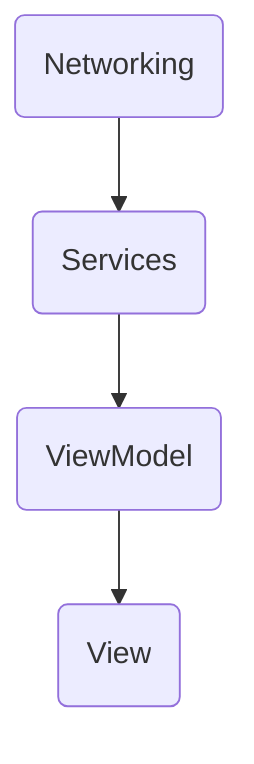

#  Photobooth iOS Challenge

Challenge following Service-oriented Architecture and MVVM Pattern.

## Table of Contents
- [🚀 Environment setup](#-environment-setup)
  - [🌍 Project Specifications](#-project-specifications)
  - [🧱 Dependencies](#-dependencies)
- [🤔 About the project](#-about-the-project)
  - [🗂 Folder Structure](#-folder-structure)
  - [📦 Dependency Injection](#-dependency-injection)
  - [🔌 App Communication](#-app-communication)
  
## 🚀 Environment setup

### 🌍 Project Specifications
1. Xcode 13+
2. iOS 11+
3. Swift 5
5. MVVM

### 🧱 Dependencies
1. [Swinject](https://github.com/Swinject/Swinject) a Dependency Injection framework
2. SwinjectAutoregistration extension to Swinject
3. [Moya](https://github.com/Moya/Moya) a Network abstraction layer framework
4. [Kingfisher](https://github.com/onevcat/Kingfisher) a pure-Swift library for downloading and caching images from the web
5. [SkeletonUI](https://github.com/CSolanaM/SkeletonUI) a skeleton loading animation

## 🤔 About the project

### 😱 What to expect?

Predesign (self made)


Final functionality
https://user-images.githubusercontent.com/15699775/164350464-794b4783-cb6c-4cc4-8e34-5a3646152630.mp4


### 🗂 Folder Structure

```swift
Photobooth
|-- Services
|   -- Models
|-- SupportingFiles
|-- Networking
|-- App
|   -- Utilities
|   -- Extensions
|-- Dependencies // Dependencies Registrations into a DI Container
|-- Views // App Screens with SwiftUI
|   -- Models
|   -- Splash
|   -- Gallery
|   -- Home 
```

### 📦 Dependency Injection

For Service Registration the project uses Swinject `Library/Dependencies/Injector.swift`

```swift
enum Injector {
    static let sharedAssambler: Assembler = {
        let container = Container()
        let assambler = Assembler(
            [
                ServiceAssembly()
            ],
            container: container
        )
        return assambler
    }()
}
```
* `ServiceAssembly` Services registrations

### 🔌 App Communication



### Pending work

#### UI Tests
Home
1. There's a navigation bar title
2. There's a back button
if cat's not loading or empty
3. There's a text label explanation
4. There's an action button
else
5. There are N sections
6. Each section has N rows with images

Gallery
1. There's a navigation title
2. There's a grid/table with an image in each row
